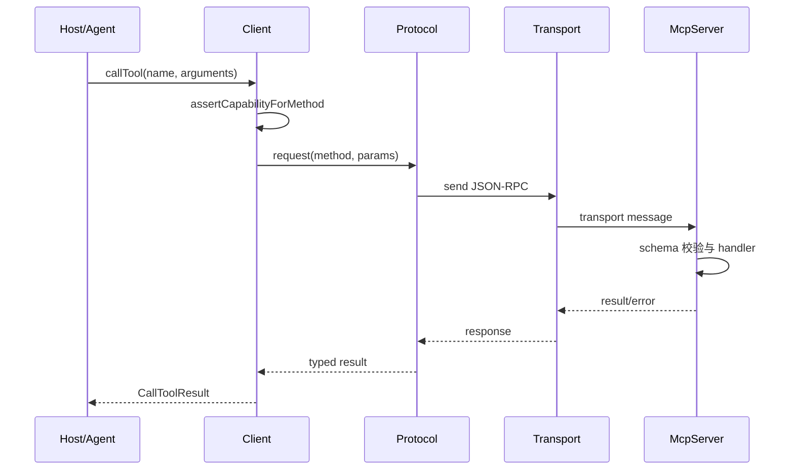

# MCP TypeScript SDK 源码导读

MCP TypeScript SDK 是协议实现，不是完整的 Agent Loop。读它时要坚持一条边界：SDK 负责把 MCP 请求、能力、传输和校验变成可用的 client/server API；模型如何决定调用哪个工具，应回到 Agent 或 Host 代码中看。本文按当前 v2 源码带你从一个工具调用追到 JSON-RPC 和 transport。

## 学习目标

- 能从 `Client.callTool()` 追到 Protocol 请求、传输发送、响应校验和错误返回。
- 能从 `McpServer.registerTool()` 追到 schema、handler、结果验证和通知。
- 能分清 v2 的 `@modelcontextprotocol/client`、`@modelcontextprotocol/server`、`@modelcontextprotocol/core` 与具体 transport。

## 前置知识

- 第 06 章的 MCP 2026-07-28、JSON-RPC、`server/discover`、Tools/Resources/Prompts、Streamable HTTP、授权边界。
- 第 02–04 章的 Tool Calling、Schema、错误和事件；只需会读少量 TypeScript。

## 版本与源码范围（2026-10-09）

本次核对官方 monorepo `modelcontextprotocol/typescript-sdk` 的 `main` 分支。当前 v2 客户端和服务端包版本均为 `2.3.1`，仓库语言为 TypeScript，包要求 Node.js `>=20`。v2 实现 MCP 2026-07-28；旧的 `@modelcontextprotocol/sdk` 位于长期维护的 `v1.x` 分支。

| 层 | 当前路径 | 先看哪些符号 |
| --- | --- | --- |
| 公共 client | [`packages/client/src/client/client.ts`](https://github.com/modelcontextprotocol/typescript-sdk/blob/main/packages/client/src/client/client.ts) | `Client`、`discover`、`listTools`、`callTool` |
| 公共 server | [`packages/server/src/server/mcp.ts`](https://github.com/modelcontextprotocol/typescript-sdk/blob/main/packages/server/src/server/mcp.ts) | `McpServer`、`registerTool`、`registerResource`、`registerPrompt` |
| 共享协议 | [`packages/core/src/`](https://github.com/modelcontextprotocol/typescript-sdk/tree/main/packages/core/src) | `Protocol`、types、schemas、auth |
| HTTP client transport | [`packages/client/src/client/streamableHttp.ts`](https://github.com/modelcontextprotocol/typescript-sdk/blob/main/packages/client/src/client/streamableHttp.ts) | `StreamableHTTPClientTransport` |
| stdio client transport | [`packages/client/src/client/stdio.ts`](https://github.com/modelcontextprotocol/typescript-sdk/blob/main/packages/client/src/client/stdio.ts) | `StdioClientTransport` |
| server transport | [`packages/server/src/server/streamableHttp.ts`](https://github.com/modelcontextprotocol/typescript-sdk/blob/main/packages/server/src/server/streamableHttp.ts) | HTTP 请求路由和响应 |

## 先看懂 client 到 server 的链路



阅读提示：`Client` 不直接创建 HTTP 请求，`McpServer` 也不直接决定网络协议；Protocol 负责请求/响应语义，Transport 负责字节和连接。沿 `callTool → request → transport → handler → result` 设置断点最容易理解分层。

## 包的边界

### `@modelcontextprotocol/client`

导出连接 MCP server 的 `Client`、transport、能力发现、缓存和授权辅助。它提供的是“作为 client 使用协议”的高层接口，不是 LLM provider。

### `@modelcontextprotocol/server`

导出 `McpServer`、工具/资源/prompt 注册与服务 transport。它把业务 handler 包装成协议可发现、可校验、可调用的能力。

### `@modelcontextprotocol/core`

共享 JSON 值、协议类型、schema、auth 和内部 Protocol 机制。读 client/server 遇到类型时，回到 core 查看真实 wire contract，不要凭方法名猜参数。

### `packages/middleware`

Express、Fastify、Hono、Node HTTP 等 middleware 只是运行时适配器。它们不应被误读成 MCP 核心能力；Host header、Origin、body 解析和路由才是它们的关注点。

## `Client`：高层能力调用面

### `Client extends Protocol`

当前 `Client` 继承共享 `Protocol`，所以既有公共能力方法，也继承 request/notification、错误和 transport 生命周期。读类定义后要跳到父类，尤其是 capability 检查和 request id 的分配。

### `MCPClientImplementation`：路线中的旧映射名

路线里的 `MCPClientImplementation` 表示“客户端实现层”的职责；当前 v2 公共源码使用的真实 class 是 `Client`，位于 `packages/client/src/client/client.ts`。不要把旧映射名当成当前导出符号。

### `Client.connect`

连接方法根据 transport 和协议时代选择连接路径。v2 的 `Client` 同时支持现代 `server/discover` 和 legacy `initialize`：未传 `versionNegotiation` 或显式使用 `mode: "legacy"` 时，默认直接走 legacy handshake；只有显式设置 `versionNegotiation: { mode: "auto" }` 才会先探测 `server/discover`，再在不支持现代协议的对端上回退到 `initialize`。源码仍保留两条分支，因此不要因为看到 `_legacyHandshake` 就把 v2 课程写回单一旧模型。

### `Client.discover`

它调用 `server/discover`，获得服务端身份、能力、协议版本/时代和其他发现结果。现代无状态请求里，发现结果是 client 建立本地能力视图的入口；之后 `assertCapabilityForMethod` 会阻止明显不支持的调用。

### `Client.listTools`

它请求工具目录，并处理分页/缓存选项。源码阅读时看结果如何经过 schema 验证、缓存新鲜度和 list-changed 通知；“列表拿到了”不等于工具授权已经完成。

### `Client.callTool`

它把工具名和参数封装成 `tools/call`，发送请求并把 `CallToolResult` 返回给 Host。重点看输入 schema 校验、输出 schema 验证、错误 result 与 JSON-RPC error 的区别，以及重试是否会重复副作用。

### `Client.readResource` 与 `Client.getPrompt`

这两个方法分别走 Resources 和 Prompts 能力。对照三者阅读可以看出：工具更像可执行动作，resource 是按 URI 读取，prompt 是参数化模板；不要把三者都简化成“函数调用”。

## `McpServer`：注册能力与执行 handler

### `McpServer`

`McpServer` 聚合 server info、注册表、completion、工具/资源/prompt handler 和通知。它把开发者提供的 callback 变成协议层的统一结果。

### `MCPServerImplementation`：路线中的旧映射名

同理，`MCPServerImplementation` 是路线中的职责名；当前 v2 的真实公共 class 是 `McpServer`。需要读实现时从 `McpServer` 的注册和 handler 方法进入，而不是搜索一个不存在的同名 class。

### `McpServer.registerTool`

注册工具时会保存名称、描述、input schema、可选 output schema 和 callback。真正调用时，server 先检查工具存在和参数，再执行 handler，最后验证输出并包装 `CallToolResult`。

### `McpServer.registerResource`

资源注册把固定 URI 或 `ResourceTemplate` 与读取 callback 关联。阅读时看 URI 匹配、metadata、订阅/list-changed 通知以及 read 错误如何回到 client。

### `McpServer.registerPrompt`

Prompt 注册定义参数 schema 与生成 callback；completion 由独立 handler 处理。它不是直接把最终 prompt 发给模型，而是向 Host 提供一个可发现、可填参的模板。

### `validateToolOutput`

输出校验是容易忽略的边界。模型或工具开发者可能只验证了输入，却在输出 schema 上失败；源码应明确这种失败是工具结果错误还是 JSON-RPC transport 错误。

## Transport：同一协议的不同管道

### `StdioClientTransport`

stdio transport 启动或连接子进程，以 stdin/stdout 传 JSON-RPC；stdout 只能承载协议消息，日志应走 stderr。它适合本机工具服务器，进程退出是明显的连接终态。

### `StreamableHTTPClientTransport`

Streamable HTTP transport 使用 HTTP 请求和流式响应承载消息，可处理断线、重连、header 和认证。它是网络适配器，不是另一个 MCP 语义层；`Client.callTool` 的能力检查仍然在上层。

### `Transport`

通用 transport 契约包含启动、发送、关闭和消息回调。实现新 transport 时，先保证消息边界、取消、错误和生命周期，再考虑框架集成。

## Schema 与错误边界

### `Standard Schema`

v2 server/client 使用 Standard Schema 兼容的校验器，可配 Zod v4、Valibot、ArkType 等。schema 是能力契约的一部分，不能只在 TypeScript 编译期相信类型。

### `JSONRPCError`

协议错误表示请求没有按 JSON-RPC 成功完成；工具业务错误则可能被包装成 `CallToolResult` 中的 `isError`。读调用者时要看它是抛异常、收到 error，还是收到一个业务失败 result。

### `assertCapabilityForMethod`

它根据 discover/协商出的能力阻止不支持的 method。能力检查能减少无意义请求，但不能代替服务端权限校验和工具内部授权。

## v2 与 v1 的阅读分叉

### `@modelcontextprotocol/sdk` 与拆分包

v1 是单包 `@modelcontextprotocol/sdk`；v2 拆成 `@modelcontextprotocol/client`、`@modelcontextprotocol/server` 等包。看到旧文章的 import 时先判断它指的是 v1 branch 还是 v2 main，不要把路径机械复制到新代码。

### `initialize` 与现代 discover

MCP 2026-07-28 的现代核心采用无状态模型；本项目 v2 仍保留 legacy 初始化代码以兼容旧协议/对端。源码阅读要把“现代 discover 入口”和“legacy handshake 分支”分开画，不要说 v2 所有请求都必须走旧 `initialize/initialized`。

## TypeScript 概念片段

下面的片段只展示 SDK 的分层关系，未连接真实 server；它不是完整可运行示例。

```typescript
// 伪代码：Host 只依赖 Client，Transport 决定连接方式。
const client = new Client(
  { name: "study-host", version: "0.1.0" },
  // 显式启用现代 discover 探测；不支持时自动回退 legacy initialize。
  { versionNegotiation: { mode: "auto" } },
);
const transport = new StdioClientTransport({ command: "python", args: ["server.py"] });

await client.connect(transport);
// connect() 已完成协议时代协商；getProtocolEra() 可观察最终选择。
console.log(client.getProtocolEra());
const tools = await client.listTools();
const result = await client.callTool({
  name: "search_notes",
  arguments: { query: "MCP" },
});
await client.close();
```

对应的 Python 思维模型如下：Host 先发现能力，再校验/授权，最后调用；Transport 不应决定业务语义。

```python
def use_mcp(client, name, arguments):
    # 输入：已连接的 MCP client、工具名和参数；输出：工具结果。
    capabilities = client.discover()
    if name not in capabilities.tools:
        raise ValueError("tool is not advertised")
    return client.call_tool(name, arguments)

# 输出：CallToolResult；协议失败与工具业务失败应分别记录。
```

## 源码阅读锚点

1. 先读 monorepo README 与 `packages/client/package.json`，确认 v2 包名、Node 要求和导出。
2. 从 `Client.callTool` 进入父类 Protocol 的 request，再进入 transport。
3. 从 `McpServer.registerTool` 进入注册表、输入/输出 schema 和 handler。
4. 对照 `listResources`/`readResource`、`listPrompts`/`getPrompt`，确认三类能力差异。
5. 最后读 Streamable HTTP、stdio、auth middleware 和 list-changed 通知。

推荐搜索词：`class Client`、`discover`、`callTool`、`assertCapabilityForMethod`、`class McpServer`、`registerTool`、`validateToolOutput`、`StreamableHTTPClientTransport`、`StdioClientTransport`、`Protocol`。

## 易混点

- MCP SDK 是协议运行时，不是 LLM Agent Loop；Host 才决定何时让模型选择工具。
- v2 拆包与 v1 单包路径不同，旧教程的 import 不一定适用。
- `discover`/能力检查不等于授权；server 仍需验证调用者和工具内部权限。
- JSON-RPC error 与 `CallToolResult.isError` 不是一个层级。
- `StdioClientTransport`、`StreamableHTTPClientTransport` 只改变传输，不改变 `callTool` 语义。

## 课后小问（含解析）

### 为什么先读 `Client.callTool`，再读 transport？

答案：这样先建立“工具调用的协议语义”，再看不同 transport 如何搬运消息。反过来容易把 HTTP/stdio 细节误认为 MCP 能力。

### v2 源码里看到 `_legacyHandshake` 是否说明必须手动 initialize？

答案：不是。它是兼容路径；现代 MCP 2026-07-28 以无状态模型和 discover 为核心。应结合 `connect` 的选择条件判断实际分支。

### 为什么输出 schema 也要读？

答案：工具正确执行不保证返回值符合能力契约。输出校验失败应被清楚地记录，否则 Host 可能把结构错误当成模型错误重试。

## 本节小结

MCP TypeScript SDK 的关键分层是 `Client/McpServer → Protocol → Transport`。Client 负责发现和调用，Server 负责注册、校验和执行，core 负责协议类型与 schema，transport 负责消息通道。v2.3.1 的现代阅读入口是拆分包和 `server/discover`，同时要识别保留的 v1 兼容分支。

## 快速回顾

- client：`discover → listTools → callTool`。
- server：`registerTool/registerResource/registerPrompt → handler → result`。
- 协议：`Protocol.request` 负责请求/响应语义。
- 传输：stdio 或 Streamable HTTP 只搬运 JSON-RPC。
- 版本：v2.3.1、`main`、Node >=20；v1 在 `v1.x`。

上例的 `auto` 连接已经在协商阶段完成现代 discover 探测。读取这次探测结果时优先使用 `client.getDiscoverResult()`；只有 `client.getProtocolEra() === "modern"` 且没有缓存结果时，才显式调用 `client.discover()` 刷新结果。若 auto 回退到 legacy，`getDiscoverResult()` 可能是 `undefined`，不要在 legacy 连接上强行调用现代 discover。

```typescript
const discovery =
  client.getDiscoverResult() ??
  (client.getProtocolEra() === "modern" ? await client.discover() : undefined);
```

## 官方源码与文档

- [MCP TypeScript SDK 官方仓库](https://github.com/modelcontextprotocol/typescript-sdk)
- [MCP TypeScript SDK v2 文档首页](https://ts.sdk.modelcontextprotocol.io/v2/)
- [v2 包与迁移说明](https://ts.sdk.modelcontextprotocol.io/v2/get-started/packages.html)
- [`Client`](https://github.com/modelcontextprotocol/typescript-sdk/blob/main/packages/client/src/client/client.ts)
- [`McpServer`](https://github.com/modelcontextprotocol/typescript-sdk/blob/main/packages/server/src/server/mcp.ts)
- [MCP 2026-07-28 规范](https://modelcontextprotocol.io/specification/2026-07-28)
