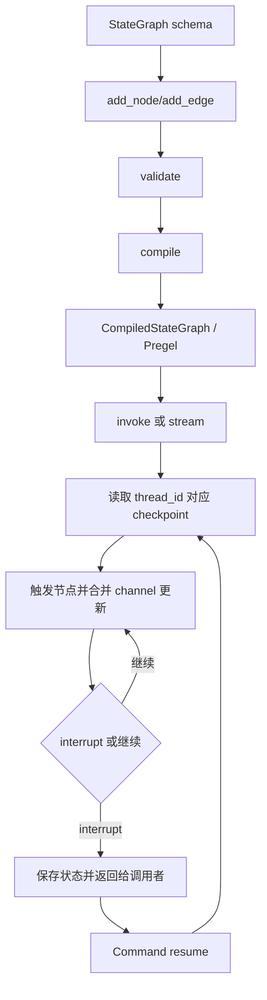

# LangGraph 源码导读

LangGraph 的核心不是“再封装一个聊天 Agent”，而是把有状态、可恢复的工作流编译成 Pregel 风格运行图。阅读时要从声明图追到编译后的 `CompiledStateGraph`，再追到 Pregel 的 `invoke/stream`、checkpoint 和 interrupt。这样才能理解它为什么适合长流程和人工接管。

## 学习目标

- 能从 `StateGraph.add_node/add_edge` 追到 `compile()` 和执行入口。
- 能区分状态 schema、channel、node、edge、thread 与 checkpoint。
- 能解释 `interrupt()` 为什么必须配 checkpointer，以及 resume 为什么会从节点开始重新执行。

## 前置知识

- 第 02–10 章的 StateMachine、Node、Edge、Checkpoint、WorkflowInterrupt、Tool Calling。
- Python 类型注解、生成器和异步迭代器的基本阅读能力。

## 版本与源码范围（2026-10-09）

本次核对官方仓库 `langchain-ai/langgraph` 的 `main` 分支。核心 Python 包 `libs/langgraph/pyproject.toml` 当前版本为 `1.2.14`，最低 Python 版本为 3.10。LangGraph 还拆有 checkpoint、prebuilt、SDK 等包，本文只抓主 runtime 的图编译和执行链。

| 先看什么 | 当前路径 | 责任 |
| --- | --- | --- |
| 图声明与编译 | [`libs/langgraph/langgraph/graph/state.py`](https://github.com/langchain-ai/langgraph/blob/main/libs/langgraph/langgraph/graph/state.py) | `StateGraph`、`CompiledStateGraph` |
| Pregel runtime | [`libs/langgraph/langgraph/pregel/main.py`](https://github.com/langchain-ai/langgraph/blob/main/libs/langgraph/langgraph/pregel/main.py) | `Pregel`、`invoke`、`stream` |
| 节点/执行辅助 | [`libs/langgraph/langgraph/pregel/`](https://github.com/langchain-ai/langgraph/tree/main/libs/langgraph/langgraph/pregel) | task、loop、runner、write |
| interrupt/Command | [`libs/langgraph/langgraph/types.py`](https://github.com/langchain-ai/langgraph/blob/main/libs/langgraph/langgraph/types.py) | `interrupt`、`Command`、`StateSnapshot` |
| checkpoint 基类 | [`libs/checkpoint/langgraph/checkpoint/base/__init__.py`](https://github.com/langchain-ai/langgraph-checkpoint/blob/main/libs/checkpoint/langgraph/checkpoint/base/__init__.py) | `BaseCheckpointSaver`、读写 checkpoint |

## 从图声明到恢复执行



阅读提示：图的关键是 `compile` 之后的对象不再只是“节点字典”，而是可调用的 Pregel runtime。`thread_id` 是 checkpoint 的查找游标，新的 thread 不会自动继承旧状态。

## `StateGraph`：声明状态和拓扑

### `StateGraph.__init__`

构造器接收 state schema，可选 context/input/output schema，并为字段建立 channel/ reducer 规则。读这里要区分“状态字段的类型”与“多个节点同时写入时如何合并”，后者决定并行图的语义。

### `StateGraph.add_node`

`add_node` 把一个可调用节点加入图，节点可以读当前 state、context，并返回局部更新。它不是立即执行；只有 compile 后由 Pregel 调度。节点名称是 checkpoint、stream 和 debug 信息中的重要标识。

### `StateGraph.add_edge`

普通 edge 表示固定的下一跳；多个起点可以汇合。读源码时注意 edge 表达的是触发关系，不是 Python 函数调用栈；节点可能被 runtime 以不同 task 调度。

### `StateGraph.add_conditional_edges`

条件边把路由函数的结果映射到下一节点。它是“工作流决策”的位置，不等于模型工具调用；路由返回值、未知目标和结束标记都应在源码中找验证。

### `StateGraph.validate`

编译前验证节点、边、入口、结束点和 schema。错误尽量在 compile 期暴露，避免 graph 已经运行后才发现悬空边。

### `StateGraph.compile`

这是声明世界进入运行世界的边界。它创建 `CompiledStateGraph`，把节点和边附着到 Pregel 结构，绑定 checkpointer、interrupt 和缓存等运行选项。要理解 LangGraph，`compile` 是首个核心断点。

## `CompiledStateGraph` 与 `Pregel`

### `CompiledStateGraph`

编译结果暴露 `invoke`、`stream` 等 Runnable 接口，同时保留图结构和 schema。它把用户友好的图 API 转成 runtime 能理解的 channels、triggers、writers 和 nodes。

### `Pregel`

`Pregel` 是执行引擎基类，组织输入、节点触发、状态写入、checkpoint、流式输出和结束。阅读时不要只看 `invoke` 外层；继续进入 `stream`、`_prepare_state_snapshot`、task/loop/runner 文件才能看到一次运行的内部节奏。

### `Pregel.invoke`

`invoke` 负责消费整个执行，返回最终输出。它适合应用层得到结果；源码阅读建议先从 `stream` 路径开始，因为 stream 更容易看到每次节点更新、interrupt 和 checkpoint。

### `Pregel.stream`

`stream` 暴露 values、updates、messages、debug 等模式。模式改变的是观察方式，不应改变状态转移本身；对照写入 channel 的代码验证这一点。

### `Pregel.update_state`

它允许外部以受控方式写入某个 thread 的状态。阅读时重点核对 as_node、版本、checkpoint id 和 reducer，否则“人工修改状态”可能绕过正常节点边界。

## State、Channel 与节点更新

### State schema

State schema 定义输入/输出与字段类型；它不是数据库 schema，也不自动代表持久化格式。持久化内容由 checkpoint 和 serializer 决定。

### Channel

Channel 是运行时保存某类状态更新的通道。字段默认覆盖还是通过 reducer 合并，决定并行节点结果如何汇合。源码阅读时从 state schema 的字段注解追到 channel 创建。

### Node return value

节点通常返回部分 state 更新，而不是完整 state。Pregel 把更新写入 channel，再触发后继节点。不要在节点中假设“返回字典就是马上写进数据库”。

## Checkpoint、thread 与 durability

### `BaseCheckpointSaver`

它定义 checkpoint 的读取、写入、写入 channel、列出历史和删除 thread 等接口。具体 saver 可以是内存、SQLite、Postgres 等；runtime 依赖接口，不依赖某个数据库。

### `thread_id`

`thread_id` 是持久化执行的逻辑游标。相同 thread 让 runtime 找回同一状态；更换 thread 会开启隔离的执行历史。它不是用户 id，也不应直接当作权限凭证。

### `StateSnapshot`

snapshot 将当前 values、next 节点、config、metadata 和任务信息暴露给调用者。调试恢复问题时，比较两个 snapshot 比比较最终文本更可靠。

### durability

durability 讨论的是状态何时、以什么保证写入持久层。不要把“有 checkpointer”简单等于“每条外部副作用都可回滚”；邮件、支付、写文件等副作用仍需幂等和业务事务边界。

## `interrupt` 与 `Command`

### `interrupt`

在节点内调用 `interrupt(value)` 会抛出内部 `GraphInterrupt`，runtime 保存状态并把值暴露给调用者。恢复时节点会从节点开头重新执行，因此 interrupt 前的副作用不能裸写，必须幂等或放到确认之后。

### `Command`

`Command(resume=...)` 把人工输入交回 runtime；它也可以表达更新和跳转等控制信息。阅读时分清 Command 是运行控制对象，不是普通 state update 字典。

### `response_schema`

当前 types.py 支持为 interrupt 指定响应 schema。它约束恢复输入形状，但不自动证明业务授权或事实正确。

## Python 案例：人工批准后继续

下面是基于官方 interrupt 语义的最小示例，展示源码阅读时要跟的“保存—返回—resume”链条；需要真实运行时再补具体依赖。

```python
from typing import TypedDict

from langgraph.checkpoint.memory import InMemorySaver
from langgraph.graph import START, StateGraph
from langgraph.types import Command, interrupt


class State(TypedDict):
    request: str
    approved: bool


def approval_node(state: State):
    approved = interrupt({"question": f"是否执行：{state['request']}？"})
    return {"approved": bool(approved)}


builder = StateGraph(State)
builder.add_node("approval", approval_node)
builder.add_edge(START, "approval")
graph = builder.compile(checkpointer=InMemorySaver())
config = {"configurable": {"thread_id": "study-001"}}

# 第一次 invoke：返回 __interrupt__，并将状态写入 checkpoint。
paused = graph.invoke({"request": "生成报告", "approved": False}, config)

# 第二次 invoke：resume 值进入原 interrupt 表达式。
finished = graph.invoke(Command(resume=True), config)

# 输出：finished["approved"] == True。
```

官方源码的 `types.py` 说明了一个容易漏掉的事实：节点会从头重跑。示例中的 `approval_node` 没有在 interrupt 前写外部副作用，正是为了避免恢复时重复执行。

## 源码阅读顺序与建议断点

1. `StateGraph.__init__`、`add_node`、`add_edge`、`compile`：画出声明到编译的转换。
2. `CompiledStateGraph`：确认 graph 如何附着节点、边和 branch。
3. `Pregel.stream`：沿一次 values/updates 运行看触发和写入。
4. `BaseCheckpointSaver.put/get_tuple/list`：看 thread、checkpoint id 和版本。
5. `interrupt` 与 `Command`：跟一次暂停和恢复，验证节点重跑。
6. 再看 retry/cache/stream modes，避免一开始陷入性能细节。

推荐搜索词：`StateGraph`、`add_conditional_edges`、`compile`、`CompiledStateGraph`、`Pregel.stream`、`BaseCheckpointSaver.put`、`thread_id`、`interrupt`、`Command`、`GraphInterrupt`。

## 易混点

- 图声明对象和编译后的 runtime 不是同一层；真正执行从 `CompiledStateGraph/Pregel` 开始。
- State schema 是运行契约，不等同于数据库持久化 schema。
- `thread_id` 决定 checkpoint 查找，不自动提供认证授权。
- `interrupt` 恢复会重跑节点，前置外部副作用必须幂等或延后。
- 有 checkpoint 不代表外部系统事务可回滚；应用仍要设计幂等键和补偿。

## 课后小问（含解析）

### 为什么不能只看 `StateGraph.add_node` 判断执行顺序？

答案：add_node 只登记节点，边和条件边决定触发；compile 后 Pregel 才把它们转成 runtime 调度结构。执行时还会受 checkpoint、retry 和 interrupt 影响。

### 为什么恢复不是“从 interrupt 那一行继续”？

答案：当前实现通过抛出 GraphInterrupt 保存状态，resume 后从节点开始重新执行，并把恢复值作为 interrupt 的返回值。因此 interrupt 前的副作用必须重新审计。

### `thread_id` 复用会带来什么结果？

答案：会读取同一执行历史，可能继续旧状态；若想完全隔离，必须新建 thread，不能只清空前端消息。

## 本节小结

LangGraph 的源码主线是 `StateGraph → compile → CompiledStateGraph/Pregel → stream/invoke`。State 通过 channel 更新，checkpoint 以 thread 保存执行游标，interrupt/Command 提供可恢复人工介入。理解这些边界后，再读 retry、cache、subgraph 和分布式 durability 才不容易迷路。

## 快速回顾

- 声明：`StateGraph.add_node/add_edge/add_conditional_edges`。
- 编译：`StateGraph.compile → CompiledStateGraph`。
- 执行：`Pregel.stream/invoke`。
- 持久化：`BaseCheckpointSaver` + `thread_id`。
- 暂停恢复：`interrupt → checkpoint → Command(resume=...)`。

## 官方源码与文档

- [LangGraph 官方仓库](https://github.com/langchain-ai/langgraph)
- [`graph/state.py`](https://github.com/langchain-ai/langgraph/blob/main/libs/langgraph/langgraph/graph/state.py)
- [`pregel/main.py`](https://github.com/langchain-ai/langgraph/blob/main/libs/langgraph/langgraph/pregel/main.py)
- [`types.py`](https://github.com/langchain-ai/langgraph/blob/main/libs/langgraph/langgraph/types.py)
- [LangGraph Checkpoint 源码](https://github.com/langchain-ai/langgraph-checkpoint/tree/main/libs/checkpoint)
- [Interrupt 官方文档](https://docs.langchain.com/oss/python/langgraph/interrupts)
- [Durable execution 官方文档](https://docs.langchain.com/oss/python/langgraph/durable-execution)
