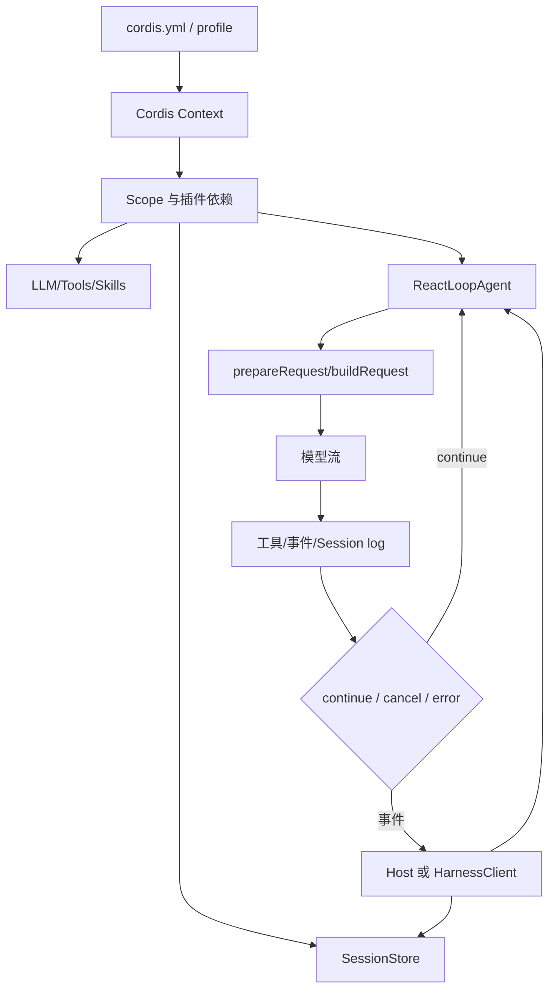

# DeepSeek Harness 源码导读

DeepSeek Harness（`dsh`）不是一个只有“模型请求 + 工具函数”的轻量 SDK，而是把模型、会话、工具、技能、沙箱、循环、存储和 UI 都装进可组合的插件运行时。本文重点是建立源码阅读路线：先看 Cordis/Context 如何组装能力，再看 session log 和 `ReactLoopAgent` 如何让一次长任务持续运行，最后看 SDK 如何从进程外驱动 Harness。

## 学习目标

- 能从真实的 `ReactLoopAgent`、`SessionStore`、Cordis Context 和 `HarnessClient` 追一条请求。
- 能分清“路线里的 AgentDriver/PluginContext 概念”和当前 master 的真实类名。
- 能从 session 事件、scope、插件生命周期和 SDK JSON-RPC 边界判断状态、资源和安全责任。

## 前置知识

- 第 02–10 章全部术语，以及前四个项目的 Loop、State、Tool、Checkpoint、Plugin 对照。
- TypeScript 的 class、Promise、AsyncIterable 和 workspace package 阅读能力；不要求先读完整前端。

## 版本与源码范围（2026-10-09）

本次核对官方仓库 `deepseek-ai/deepseek-harness` 的 `master` 分支。仓库主语言为 TypeScript，根 `package.json` 当前版本为 `0.2.1-alpha.2`，要求 Node.js `^22.19.0 || >=24.0.0`，仍是 developer preview。官方明确警告会有兼容性破坏，运行前必须阅读安全说明。

| 先看什么 | 当前路径 | 责任 |
| --- | --- | --- |
| 具体 Agent loop | [`packages/core/agent-loop/src/agent.ts`](https://github.com/deepseek-ai/deepseek-harness/blob/master/packages/core/agent-loop/src/agent.ts) | `ReactLoopAgent`、turn/step、取消和请求构建 |
| Agent 公共模型 | [`packages/core/agent/src/`](https://github.com/deepseek-ai/deepseek-harness/tree/master/packages/core/agent/src) | dispatch、model selection、projection |
| 会话与事件 | [`packages/core/session/src/index.ts`](https://github.com/deepseek-ai/deepseek-harness/blob/master/packages/core/session/src/index.ts) | `Session`、`SessionStore`、事件/消息投影 |
| 作用域 | [`packages/core/scope/src/index.ts`](https://github.com/deepseek-ai/deepseek-harness/blob/master/packages/core/scope/src/index.ts) | `Scope`、`createScope`、资源释放 |
| 工具 | [`packages/core/tools/src/`](https://github.com/deepseek-ai/deepseek-harness/tree/master/packages/core/tools/src) | schema、执行模式、工具类型 |
| LLM | [`packages/llm/llm/src/`](https://github.com/deepseek-ai/deepseek-harness/tree/master/packages/llm/llm/src) | provider-neutral message/stream/adapter |
| SDK client | [`packages/sdk/client/src/client.ts`](https://github.com/deepseek-ai/deepseek-harness/blob/master/packages/sdk/client/src/client.ts) | `HarnessClient`、启动 runtime、订阅事件 |
| SDK protocol | [`packages/sdk/protocol/src/`](https://github.com/deepseek-ai/deepseek-harness/tree/master/packages/sdk/protocol/src) | stdio JSON-RPC 请求、结果、通知 |

## 先看懂 Harness 的组装关系



阅读提示：Harness 的“依赖注入”不是一个孤立的工具注册表；它决定哪些插件挂载到哪个 Context/Scope。读一次请求时，一边追 `ReactLoopAgent.turn/step`，一边追 session event 如何被 append 和投影。

## 先纠正几个路线名

### `AgentDriver`：概念名，不是当前核心类

早期学习路线把“驱动 Agent 一轮又一轮执行”的角色叫 `AgentDriver`。当前 `master` 的已核对入口是 `packages/core/agent-loop/src/agent.ts` 中的 `ReactLoopAgent`，仓库源码里不要假定有一个名为 `AgentDriver` 的核心 class。阅读时把 `AgentDriver` 映射为“驱动职责”，把实际断点放到 `ReactLoopAgent`。

### `PluginContext`：概念边界，实际使用 Cordis `Context`

插件拿到的上下文在当前文档/源码中来自 `@deepseek-ai/cordis` 的 `Context`。`PluginContext` 可作为学习笔记里的描述词，但搜索源码应优先搜 `Context`、`apply(ctx)`、`inject`、`provide`、`createScope`。

### `SkillRuntime` 与 `HookRuntime`：能力族，不要臆造单一入口

技能和 hook 是 Harness 的能力族。当前仓库按 package 与插件分散实现，不能把它们想象成必然存在的两个顶层类。读源码时先从 package README、配置和注册入口找到具体实现，再追它如何投影到 system prompt、session event 或 agent step。

## Cordis Context 与插件装配

### `apply(ctx)`

官方 Cordis 教程中的最小插件导出 `apply(ctx)`，由 loader 调用并向 Context 注册能力。配置列表的顺序不保证服务准备顺序；依赖应通过 `inject`/服务依赖表达。这是理解“everything is a plugin”的第一处断点。

### `Context`

Context 是插件读写服务、事件和生命周期的运行时入口。读插件时先记录它从 ctx 取得什么、向 ctx 提供什么、监听什么事件、销毁时释放什么资源。

### `inject`

依赖声明决定插件何时可以启动和何时收到服务。它比配置文件中的排列顺序可靠；缺失依赖、循环依赖和可选依赖应在 loader/runtime 的错误路径中验证。

### `createScope`

Scope 把资源生命周期和隔离边界绑定在一个 key 上。当前 `packages/core/scope/src/index.ts` 暴露 `createScope`、`scopeOf`、`scopeTarget` 和 `Scope.dispose()`；读 session、agent、subagent 时尤其要找 scope 的创建和释放。

## `ReactLoopAgent`：当前真实的 loop 入口

### `ReactLoopAgent.send`

`send` 把用户消息投递到指定 inbox，并决定是否唤醒 driver。这里是“输入进入 Agent”的位置，不代表模型已经请求；断点应记录 target、wakeup 和当前 phase。

### `ReactLoopAgent.followup`

followup 表示追加一条用户/系统驱动的后续输入，通常在当前工作完成或需要继续时加入。它和 `steer`、`inject` 的语义不同，读源码时要看消息进入哪个队列。

### `ReactLoopAgent.steer`

steer 用来改变正在运行任务的方向；它不是简单追加历史。重点看它如何与当前 turn/step、取消信号和 inbox 顺序交互。

### `ReactLoopAgent.inject`

inject 把上下文或控制信息注入当前运行。注入内容可能影响 system prompt、模型请求或下一步工具选择，必须沿 `prepareRequest` 验证最终是否进入模型输入。

### `ReactLoopAgent.cancel`

cancel 是显式停止入口，携带取消原因和选项。阅读时追 signal、phase、inbox 和 session event，确认取消后是否仍会提交一条半完成的 step，以及外部工具如何清理。

### `ReactLoopAgent.whenIdle`

它提供“当前 loop 归于空闲”的观察点。不要把 idle 当作进程退出；插件、session flush 和订阅可能仍有自己的生命周期。

### `ReactLoopAgent.kick`

`kick` 是驱动循环从队列开始/继续工作的内部入口。可把它看作从 inbox 到 turn 的桥，而不是业务层公开 API。

### `ReactLoopAgent.preStep`

在一次 step 真正发模型请求前准备目标、位置和上下文。这里适合检查工具集合是否变化、上下文是否已经投影以及 step 编号是否与 session log 一致。

### `ReactLoopAgent.turn` 与 `step`

`turn` 组织一轮较大的对话推进，`step` 处理一个具体动作/模型请求边界。读这两个函数时重点画出“一个 turn 里有多少 step、哪个错误会结束 turn、哪个错误会结束 agent”。

### `ReactLoopAgent.prepareRequest` 与 `buildRequest`

前者准备请求所需的上下文和能力，后者把它们组装成模型可消费的请求。它们是 context engineering、技能投影、工具列表和 token 压力的汇合处，也是最值得和第 05 章对照的源码锚点。

## Session：把运行事实写成可恢复事件

### `Session`

当前 `Session` 不是只保存一串聊天文本；它包含有序事件、消息投影、工具历史、请求头和插件记录。读取 `deriveMessages` 时要区分“原始事实”和“给模型/UI 的投影”。

### `SessionStore.create`

`SessionStore` 创建或准备 session，并把它挂到 Context/Scope。检查这里的 id、父子关系、进入/离开和重复创建错误，才能理解多会话隔离。

### `SessionStore.enter` 与 `detach`

enter 把 session 放入当前作用域；返回的 detach 函数负责解除绑定。资源释放顺序是源码阅读的重点：先退出 scope 还是先 flush session，会影响丢事件和残留监听器。

### `Session.append`/commit 语义

当前文件通过私有 commit 和事件快照把事件纳入 session 序列。不要把派生 message 直接写回原始事件，否则 replay 和审计会失去事实来源。

### `Session.deriveMessages`

它从事件派生模型/UI 消息。对照 `deriveEventMessage`、`surface` 和 `toolHistory` 阅读，可以看出 context injection、工具结果和折叠摘要如何被投影。

## Tools、LLM 与 Skills/Hook 的阅读入口

### `packages/core/tools`

工具 package 拆开了 JSON schema、TypeScript/Python 类型、执行模式、presentation 和测试。源码阅读时从 tool definition 到 execution mode，再到 session/tool history，确认工具“被发现”和“被执行”之间隔了哪些策略。

### `packages/llm/llm`

它提供 provider-neutral 的 message、content、assistant stream、retry policy 和 adapter failure；具体 DeepSeek/pi-ai provider 在相邻 package。这样模型适配不会直接污染 agent loop。

### Skills 的运行时含义

Skill 通常提供指令、资源和脚本，加载后影响 system prompt 或可用工具；读具体 skill package 时关注 discovery、加载、卸载与 session projection。不要把 Skill 当成普通 Tool：Skill 改变的是能力上下文，Tool 才是一次可调用动作。

### Hook 的运行时含义

Hook 是生命周期/事件切入点，适合观测、审批、策略和扩展；它不应悄悄改变事实事件的顺序。追 hook 时找注册、触发、错误传播和 dispose 四处，而不是只看回调函数。

## `HarnessClient`：进程外驱动边界

### `HarnessClient.start`

SDK client 启动或准备 `dsh --profile sdk` 运行时。它将“你的 Python/TS 程序”和“完整 Harness 进程”隔开，资源、凭据、session 和 plugin 由 runtime profile 管理。

### `HarnessClient.initialize`

它执行 SDK 协议级的初始化，不应与 MCP 的 `initialize` 混淆。读 protocol/types 以确认请求/响应字段和运行时能力，不要凭名字复用 MCP 客户端代码。

### `HarnessClient.prompt`

它向指定 session 发送 prompt，并等待协议层结果。真正的 Agent loop 在 runtime 内部发生；client 只看到结果与通知。

### `HarnessClient.subscribe`

订阅返回 `AsyncIterable` 风格的 notification stream，可观察 session event、agent status 和 subagent 完成。订阅关闭、runtime 退出和协议错误必须分开处理。

### `HarnessClient.close`

关闭会终止/等待子进程并清理订阅。把它与 Scope.dispose、SessionStore.flush 对照阅读，能理解三层生命周期为什么不能由一个消费者随意代管。

## Python 视角：从进程外调用 Harness

下面是概念性 Python 伪代码，表达官方 Python SDK 的边界：Python 客户端通过 stdio JSON-RPC 驱动同版本 runtime，并且必须显式指定 Harness home；它不是直接 import TypeScript loop。

```python
def run_harness_turn(harness, session_id, text):
    # 输入：已启动的 Harness runtime、session id、用户消息。
    harness.initialize()
    output = harness.prompt(session_id, [{"type": "text", "text": text}])
    events = list(harness.subscribe_session_tree(session_id))
    harness.close()
    return {"output": output, "events": events}

# 输出：runtime 结果 + 事件；loop、插件和持久化仍在 Harness 进程内。
```

真正运行时请以官方 `python/sdk` 文档和发布包版本为准，尤其不要让测试代码自动读取默认 `~/.dsh` 或把真实凭据放进 workspace。

## 源码阅读锚点

1. 先读官方 README、`SAFETY.md` 和根 `package.json`，固定 branch/version/Node。
2. 从 `packages/core/agent-loop/src/agent.ts` 的 `send → kick → turn → step` 建立 loop 主线。
3. 在 `prepareRequest/buildRequest` 观察 context、tools、skills 和 model adapter 如何汇合。
4. 同时读 `SessionStore.create/enter/flush`，把事件事实和 message projection 分开。
5. 读 `scope/createScope/dispose`，核对插件、session、订阅和子进程的所有权。
6. 最后读 `packages/sdk/client` 与 `protocol`，从进程外重新验证 prompt 和 notification 链路。

推荐搜索词：`ReactLoopAgent`、`preStep`、`prepareRequest`、`buildRequest`、`SessionStore`、`deriveMessages`、`createScope`、`apply(ctx)`、`HarnessClient`、`HarnessSdkNotificationMap`。

## 易混点

- 当前核心 loop 是 `ReactLoopAgent`，不要把路线里的 `AgentDriver` 当成已验证 class。
- `Context`/Scope 提供能力与生命周期，不等于“所有插件都可信”。
- Session 原始事件、派生 message、UI surface 和模型上下文是不同投影。
- `HarnessClient.initialize` 是 Harness SDK 协议，不是 MCP 初始化。
- developer preview 的 plugin、代码执行、网络、凭据和文件访问都可能造成真实副作用；官方安全说明不承诺隔离。

## 课后小问（含解析）

### 读 Harness 为什么先看 session，而不是先看 UI？

答案：session event 是跨 UI、模型、工具和恢复的事实来源；UI 只是其中一个 projection。先看 session 才能理解什么可重放、什么可查询、什么只是展示。

### 为什么 `AgentDriver` 不能直接作为搜索词结论？

答案：它是架构职责的描述名，当前 master 已核对的真实 loop 类是 `ReactLoopAgent`。源码阅读必须以实际 symbol 为准，旧路线名只能作为映射。

### `HarnessClient.close()` 能否替代所有插件的 dispose？

答案：不能。client 关闭进程只是外层生命周期；插件 scope、session flush、订阅和工具资源各有所有权，必须沿 runtime 的 dispose 链分别验证。

## 本节小结

DeepSeek Harness 的主线是 `Cordis Context/Scope → SessionStore + capability plugins → ReactLoopAgent → model/tool/event → session log`；进程外则由 `HarnessClient → SDK protocol → dsh runtime` 驱动。阅读时应以当前 master 的真实符号为锚点，特别关注事件事实、投影、生命周期和开发预览安全边界。

## 快速回顾

- 真实 loop：`ReactLoopAgent.send → kick → turn → step`。
- 请求构建：`preStep → prepareRequest → buildRequest`。
- 会话：`SessionStore.create/enter/flush`，事件再派生消息。
- 组装：Cordis `Context`、`apply(ctx)`、`Scope.dispose`。
- 外部驱动：`HarnessClient.initialize/prompt/subscribe/close`。
- 风险：developer preview，不是安全沙箱或生产保证。

## 官方源码与文档

- [DeepSeek Harness 官方仓库](https://github.com/deepseek-ai/deepseek-harness)
- [README 与运行方式](https://github.com/deepseek-ai/deepseek-harness#readme)
- [安全说明](https://github.com/deepseek-ai/deepseek-harness/blob/master/SAFETY.md)
- [`ReactLoopAgent`](https://github.com/deepseek-ai/deepseek-harness/blob/master/packages/core/agent-loop/src/agent.ts)
- [`Session` 与 `SessionStore`](https://github.com/deepseek-ai/deepseek-harness/blob/master/packages/core/session/src/index.ts)
- [`Scope`](https://github.com/deepseek-ai/deepseek-harness/blob/master/packages/core/scope/src/index.ts)
- [LLM package group](https://github.com/deepseek-ai/deepseek-harness/tree/master/packages/llm)
- [SDK package group](https://github.com/deepseek-ai/deepseek-harness/tree/master/packages/sdk)
- [Python SDK](https://github.com/deepseek-ai/deepseek-harness/tree/master/python/sdk)
- [Cordis 教程：第一个插件](https://github.com/deepseek-ai/deepseek-harness/blob/master/docs/cordis-tutorial/01-first-plugin.md)
- [DeepSeek Harness 官方介绍](https://www.deepseek.com/harness/en/)
