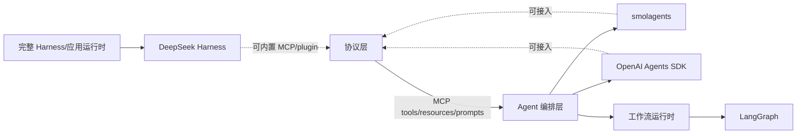

# 五个项目架构对照

前五篇分别读了 smolagents、OpenAI Agents SDK、MCP TypeScript SDK、LangGraph 和 DeepSeek Harness。它们不是五个同层级的 Agent 框架：MCP SDK 主要实现协议，LangGraph 主要实现有状态工作流运行时，另外三个才更接近 Agent/harness 应用层。本文用统一维度对照，帮助你读源码时先判断“我正在看的这段代码属于哪一层”。

本文把这种统一维度的对照称为 `ArchitectureComparison`：它是本章的分析方法，不是五个项目共同实现的 API。

## 学习目标

- 能说明五个项目各自解决什么问题，避免把协议、工作流和 Agent harness 混为一谈。
- 能用 Loop、State、Tool、Session、Persistence、Extension、Failure 七个维度定位源码。
- 能根据一个需求选择下一份源码，而不是只按项目热度跳读。

## 前置知识

- 本章前五篇源码导读，以及第 02–10 章的 Agent Loop、Model、Tool、State、MCP、Memory、Evals 与安全。

## 五个项目的当前基线（2026-10-09）

版本是本次从官方仓库默认分支/配置核对的读书基线，后续变更以仓库提交为准。

| 项目 | 当前默认分支/版本 | 主要语言 | 它处在哪一层 |
| --- | --- | --- | --- |
| [smolagents](https://github.com/huggingface/smolagents) | `main` / `1.27.0.dev0`（稳定 `v1.26.0`） | Python | 小型 Agent library，强调 code/tool agent |
| [OpenAI Agents SDK](https://github.com/openai/openai-agents-python) | `main` / `0.23.1` | Python | Agent orchestration SDK，含 Runner、handoff、guardrail、session、tracing |
| [MCP TypeScript SDK](https://github.com/modelcontextprotocol/typescript-sdk) | `main` / v2.3.1 | TypeScript | MCP 协议 client/server SDK，不是 Agent loop |
| [LangGraph](https://github.com/langchain-ai/langgraph) | `main` / `langgraph 1.2.14` | Python | 有状态图与 Pregel workflow runtime |
| [DeepSeek Harness](https://github.com/deepseek-ai/deepseek-harness) | `master` / `0.2.1-alpha.2` | TypeScript | 插件化 Agent harness/应用运行时，developer preview |

## 一张图看层级关系



阅读提示：图中的箭头是“可组合关系”，不是继承关系。MCP SDK 可以被 Agent 或 Harness 使用，LangGraph 可以承载 Agent 节点，但它们都不因此变成同一个框架。

## 统一维度一：主循环（Loop）

### smolagents 的 `MultiStepAgent`

主线是 `run → _run_stream → _step_stream`。子类以 `CodeAgent` 或 `ToolCallingAgent` 决定动作表示，父类集中处理步骤、memory 和最大步数。适合先学“最小 Agent loop”。

### OpenAI Agents SDK 的 `Runner`

主线是 `Runner → AgentRunner → run_internal`，一个 run 可以有多个 turn，turn 中可能发生工具调用、handoff、guardrail 和流式事件。适合学运行级编排和观测。

### MCP SDK 的 `Client/McpServer`

它没有替模型做决策的 Agent loop。`Client.callTool` 是“已决定调用哪个工具”后的协议调用；模型循环在 Host 或上层 Agent 中。

### LangGraph 的 `Pregel`

Loop 不围绕单个模型响应，而围绕节点触发、channel 更新和 checkpoint。一个节点可以调用模型，但 runtime 关心的是状态转移和图调度。

### DeepSeek Harness 的 `ReactLoopAgent`

当前 master 的真实入口是 `ReactLoopAgent`，通过 inbox、turn、step、请求构建、工具和事件推动长任务。路线中的 `AgentDriver` 是职责概念，不应当当作当前核心 class。

## 统一维度二：状态（State）与会话（Session）

### `AgentMemory`、`Session`、`StateGraph`、`SessionStore`

| 项目 | 主要状态单元 | 重点问题 |
| --- | --- | --- |
| smolagents | `AgentMemory` / `MemoryStep` | 本次 run 的步骤如何重渲染成消息 |
| OpenAI Agents SDK | `RunResult`、`RunContext`、`Session` | turn/run 上下文与历史持久化如何分开 |
| MCP SDK | client capability/discovery cache | 能力目录与协议状态，不保存 Agent 对话 |
| LangGraph | State channels、`StateSnapshot` | 节点更新如何合并、按 thread 恢复 |
| DeepSeek Harness | `Session`/`SessionStore`/事件 log | 原始事件、消息 projection、插件记录和长期运行 |

不要把这些都叫“memory”：smolagents 的 memory 更接近 run history，LangGraph 的 state 是 workflow 数据，DeepSeek 的 session 是可投影事件事实，MCP client 的发现缓存只是能力视图。

## 统一维度三：工具与能力扩展

### Tool 的不同位置

- smolagents：`Tool` 既是 schema/描述也是本地调用对象，`ToolCallingAgent` 或 `CodeAgent` 消费它。
- OpenAI Agents SDK：function tools、MCP tools、handoff 都会进入 Agent 可用能力，但 handoff 还会改变当前 Agent。
- MCP SDK：`McpServer.registerTool` 把 handler 暴露成协议能力，client 用 `listTools/callTool` 使用；SDK 不决定何时调用。
- LangGraph：工具通常由节点或预构建 agent 消费，graph runtime 负责节点调度而非统一工具注册表。
- DeepSeek Harness：tools、skills、LLM adapters、sessions 等都可以成为插件能力，能力发现和运行时 scope 比一个工具列表更宽。

### MCP 与 Plugin 的边界

MCP 是跨进程/跨应用的协议边界；Plugin 是同一运行时的装配和生命周期边界。一个插件可以使用 MCP client，也可以提供 MCP server，但两者不能互换概念。

## 统一维度四：持久化、暂停与恢复

### `AgentMemory` 与 `Session`

smolagents 的源码主线默认关注一个 Agent run；OpenAI SDK 的 Session 提供对话历史接口，Runner 负责在 run 前后读写。两者都不能自然推出 LangGraph 那种可恢复图状态。

### `BaseCheckpointSaver` 与 `interrupt`

LangGraph 把 checkpoint 和 `thread_id` 放进 runtime 核心，`interrupt` 依赖它保存节点状态并用 `Command(resume=...)` 恢复。恢复会从节点开始重跑，因此外部副作用要幂等。

### DeepSeek session log

DeepSeek Harness 以 append-only session event 和 projections 支撑长任务、UI、工具历史与恢复。它更像运行事实总线，而不是只保存“最后一条对话文本”。

### MCP 的无状态核心

MCP 2026-07-28 的现代核心强调无状态请求；SDK 可能有 transport、缓存和 legacy 兼容状态，但不要把 MCP server 当作 Agent session store。

## 统一维度五：可靠性与错误边界

### 模型错误

smolagents 在 Model/Agent step 附近处理解析与执行反馈；OpenAI SDK 把 provider 错误、Runner 停止、guardrail tripwire 和 tool error 分层；LangGraph 把节点错误与 checkpoint/retry 组合；DeepSeek 把 provider、事件、session、插件和 runtime 关闭分开。MCP SDK 主要处理 JSON-RPC/schema/transport 错误，不负责业务重试。

### 副作用错误

源码阅读时在每个项目都问同一个问题：模型响应被接受后，工具副作用发生前还有没有审批/授权/幂等检查？如果工具已执行，再遇到 session/checkpoint 写入错误，重试会不会重复执行？这比记住某个异常类名更重要。

## 统一维度六：扩展与依赖

### 继承式扩展：smolagents

读 `MultiStepAgent` 子类和 executor/model/tool 抽象，适合学习“小核心 + 可替换组件”。扩展点清晰，但自己组合生产级 session、权限和持久化时要补更多边界。

### 配置式编排：OpenAI Agents SDK

通过 Agent、tools、handoffs、guardrails、sessions 和 RunConfig 组合流程。适合直接构建应用；阅读时要追运行时依赖，而不是把每个配置字段当作独立功能。

### 协议式扩展：MCP SDK

通过标准 schema、discover 和 transport 与外部能力连接。扩展的代价是网络、版本、权限和不可信 server；不能只看 TypeScript 类型安全。

### 图式扩展：LangGraph

用节点、边、条件路由、subgraph、checkpointer 和 interrupt 组合工作流。扩展重点是 state reducer、调度和恢复语义。

### 插件式扩展：DeepSeek Harness

Cordis Context/Scope 组装插件和服务，能力可替换、可监听、可销毁。扩展重点是依赖排序、资源所有权、事件事实和隔离；当前仍是 developer preview。

## 五个项目统一的源码阅读模板

每读一个项目，按下面顺序填写笔记：

1. **入口**：用户调用哪个函数/命令，最终进入哪个 runtime class？
2. **当前状态**：状态存在哪，谁拥有它，是否可恢复？
3. **决策**：模型、路由或图在哪里决定下一步？
4. **副作用**：工具、文件、网络、进程在哪执行？执行前有何授权？
5. **错误**：模型错误、业务错误、协议错误、持久化错误如何区分？
6. **观测**：trace、event、session 或 stream 哪个是事实来源？
7. **生命周期**：谁创建、谁关闭、谁 flush，消费者能否越权 dispose？

## Python 对照表：把五种结构放在一段伪代码里

下面不是任何项目的实际 API，而是为了用同一语言对照五种职责。

```python
def compare_layers(task):
    # smolagents：一个 Agent loop 负责多步动作。
    agent_result = small_agent.run(task)

    # OpenAI Agents SDK：Runner 管 turn、handoff、guardrail 和 session。
    runner_result = runner.run(agent, task, session=session)

    # MCP：已决定动作后，通过协议调用外部能力。
    tool_result = mcp_client.call_tool("search", {"query": task})

    # LangGraph：把 task 作为 graph state，按节点和 checkpoint 推进。
    graph_result = graph.invoke({"task": task}, config={"thread_id": "t-1"})

    # DeepSeek Harness：通过 runtime/session/plugin 组合驱动长任务。
    harness_result = harness.prompt("session-1", task)
    return agent_result, runner_result, tool_result, graph_result, harness_result

# 输出：五个结果的形状和生命周期不同，不能直接互换。
```

这段代码只用于提出问题：每个结果由谁产生？是否带历史？是否持久化？失败后从哪里恢复？

## 推荐的源码精读顺序

1. **smolagents**：先建立最小 `AgentLoop → Tool/Code → Memory` 心智模型。
2. **OpenAI Agents SDK**：增加 Runner、handoff、guardrail、Session 和 tracing 的运行时分层。
3. **MCP TypeScript SDK**：把“能力调用”抽离成协议、schema、transport 边界。
4. **LangGraph**：把线性的 turn 扩展为状态图、checkpoint 和 interrupt。
5. **DeepSeek Harness**：综合插件、scope、session log、长任务和进程外 SDK。

如果只想查一个问题：工具协议看 MCP；最小循环看 smolagents；Agent 编排看 OpenAI SDK；恢复工作流看 LangGraph；插件化长任务看 DeepSeek Harness。

## 源码阅读锚点

下面的断点表是五个项目的统一入口，先按项目选择一组，再回到前五篇看完整调用链。

| 项目 | 第一组搜索词 |
| --- | --- |
| smolagents | `MultiStepAgent.run`、`_run_stream`、`CodeAgent._step_stream`、`LocalPythonExecutor` |
| OpenAI Agents SDK | `Runner.run`、`AgentRunner._run_impl`、`run_single_turn`、`Handoff`、`InputGuardrail` |
| MCP TypeScript SDK | `Client.callTool`、`discover`、`McpServer.registerTool`、`Protocol`、`Transport` |
| LangGraph | `StateGraph.compile`、`CompiledStateGraph`、`Pregel.stream`、`BaseCheckpointSaver`、`interrupt` |
| DeepSeek Harness | `ReactLoopAgent`、`prepareRequest`、`SessionStore`、`createScope`、`HarnessClient` |

## 易混点

- 五个项目不是同一层级：MCP SDK 不是 Agent Loop，LangGraph 不是 MCP server，DeepSeek Harness 也不是单纯模型 SDK。
- `Tool`、`MCP Tool`、`Plugin`、`Skill` 都是能力，但协议、生命周期和副作用边界不同。
- `AgentMemory`、`Session`、`StateSnapshot`、MCP discovery cache 不应都翻译成“记忆”。
- 看到相似的 `run/invoke/callTool/prompt` 不代表停止条件、持久化和错误语义相同。
- 版本、默认分支和真实 symbol 会变；文章中的链接是导航，不是永久 API 承诺。

## 课后小问（含解析）

### 想接入一个外部数据库查询工具，先读哪个项目？

答案：先读 MCP SDK，理解 tool schema、discover、transport、错误和授权；再回到上层 Agent 项目看模型如何选择工具。

### 想让流程暂停等待人工批准并在明天继续，先读哪个项目？

答案：先读 LangGraph 的 checkpointer、thread、interrupt 和 Command；如果要做长时间插件化应用，再对照 DeepSeek Harness 的 session/event/scope 生命周期。

### 为什么不能把 MCP server 当作一个 Agent？

答案：MCP server 暴露 tools/resources/prompts，响应 client 请求；它不负责模型推理、循环停止、任务状态或多步规划，决策属于 Host/Agent。

## 本节小结

五个项目可以组成一条学习链：smolagents 讲最小 Agent loop，OpenAI Agents SDK 讲应用级编排，MCP SDK 讲标准能力协议，LangGraph 讲可恢复状态工作流，DeepSeek Harness 讲插件化长任务运行时。对照源码时先找层级，再找入口、状态、副作用、错误和生命周期。

## 快速回顾

- 最小 loop：smolagents `MultiStepAgent`。
- 编排 loop：OpenAI SDK `Runner/AgentRunner`。
- 协议层：MCP `Client/McpServer/Transport`。
- 工作流层：LangGraph `StateGraph/Pregel/Checkpoint`。
- Harness 层：DeepSeek `Context/Scope/SessionStore/ReactLoopAgent`。
- 统一问题：谁拥有状态？谁执行副作用？失败从哪里恢复？

## 官方源码与文档

- [smolagents](https://github.com/huggingface/smolagents)
- [OpenAI Agents SDK](https://github.com/openai/openai-agents-python)
- [MCP TypeScript SDK](https://github.com/modelcontextprotocol/typescript-sdk)
- [LangGraph](https://github.com/langchain-ai/langgraph)
- [DeepSeek Harness](https://github.com/deepseek-ai/deepseek-harness)
- [MCP 2026-07-28 规范](https://modelcontextprotocol.io/specification/2026-07-28)
- [DeepSeek Harness 安全说明](https://github.com/deepseek-ai/deepseek-harness/blob/master/SAFETY.md)
